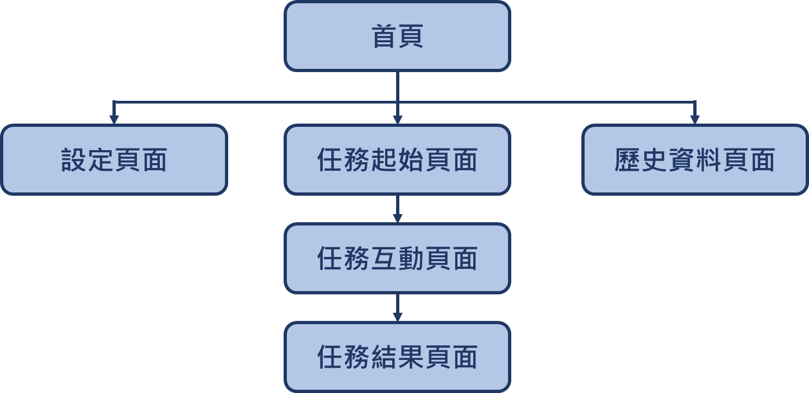

# Stroop Task
## 任務介紹
* Stroop Task 是一項著名心理學實驗，此任務以其提出者 John Ridley Stroop 為名，他於 1935 年在《the Journal of Experimental Psychology》上發表了一篇名為 "Studies of interference in serial verbal reactions" 的文章，其中就包含了 Stroop Task 的最初版本。
* Stroop Task 最初版 : 
    * 任務內容 : 實驗者會給予受試者一張印有文字的紙張，受試者需要依照不同實驗需求念出所需的答案。
    * 任務階段 : 共兩部分
        1. 受試者需要唸出文字的 **字義** (e.g. 看到 $\color{green}{\text{紅色}}$，受試者回答「紅色」)
        2. 受試者需要唸出文字的 **顏色** (e.g. 看到 $\color{green}{\text{紅色}}$，受試者回答「綠色」)
* 由於我的 Lab 需要進行此實驗，同時要將 Stroop Task 轉換為數位版，並提供更多任務可以調整的選項，而此專案即為成果 : 
    * 任務內容 : 受試者在看到手機螢幕上顯示的文字或色塊後，需要依照不同任務要求點擊下方的顏色方塊作為回答，回答時需要越快越好。
    * 任務階段 : 可分為 $\color{blue}{\text{3 測驗模式(mode)} \times  \text{2 題目類型(trialType)}}$，共六種測驗
        1. $\color{blue}{\text{中立 (Neutral)} \times \text{顏色}}$ : 畫面中顯示色塊，受試者需要回答**色塊的顏色**
        2. $\color{blue}{\text{中立 (Neutral)} \times \text{字義}}$ : 畫面中顯示文字，顏色為黑色，受試者需要回答**文字的字義**
        3. $\color{blue}{\text{一致性 (Congruent)} \times \text{顏色}}$ : 畫面中顯示文字，顏色與文字字義相同，受試者需要回答**文字的顏色**
        4. $\color{blue}{\text{一致性 (Congruent)} \times \text{字義}}$ : 畫面中顯示文字，顏色與文字字義相同，受試者需要回答**文字的字義** (與第3種相同)
        5.  $\color{blue}{\text{不一致性 (Uncongruent)} \times \text{顏色}}$ : 畫面中顯示文字，顏色與文字字義不同，受試者需要回答**文字的顏色**
        6. $\color{blue}{\text{不一致性 (Uncongruent)} \times \text{字義}}$ : 畫面中顯示文字，顏色與文字字義不同，受試者需要回答**文字的字義**
    * 其餘任務詳細設定請見 [任務選項](##任務選項)
## 專案細節
* App 主要結構 : 

### 首頁 (`MainActivity.kt`)

### 設定頁面 (`SettingActivity.kt`)
### 任務起始頁面 (`TrialStartActivity.kt`)
### 任務互動頁面 (`TrialActivity.kt`)
### 任務結果頁面 (`TrialResultActivity.kt`)
### 歷史資料頁面 (`ListFilesActivity.kt`)
## 任務選項
## 資料傳遞

