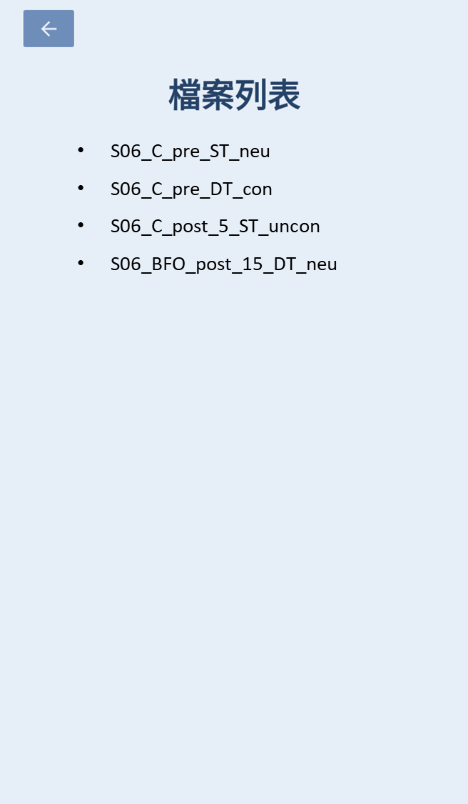

# Stroop Task
## 任務介紹
* Stroop Task 是一項著名心理學實驗，此任務以其提出者 John Ridley Stroop 為名，他於 1935 年在《the Journal of Experimental Psychology》上發表了一篇名為 "Studies of interference in serial verbal reactions" 的文章，其中就包含了 Stroop Task 的最初版本。
* Stroop Task 最初版 : 
    * 任務內容 : 實驗者會給予受試者一張印有文字的紙張，受試者需要依照不同實驗需求念出所需的答案。
    * 任務階段 : 共兩部分
        1. 受試者需要唸出文字的 **字義** (e.g. 看到 $\color{green}{\text{紅色}}$，受試者回答「紅色」)
        2. 受試者需要唸出文字的 **顏色** (e.g. 看到 $\color{green}{\text{紅色}}$，受試者回答「綠色」)
* 由於我的 Lab 需要進行此實驗，同時要將 Stroop Task 轉換為數位版，並提供更多任務可以調整的選項，而此專案即為成果 : 
    * 任務內容 : 受試者在看到手機螢幕上顯示的文字或色塊後，需要依照不同任務要求點擊下方的顏色方塊作為回答，回答時需要越快越好。
    * 任務階段 : 可分為 $\color{#113285}{\text{3 測驗模式(mode)} \times  \text{2 題目類型(trialType)}}$，共六種測驗
        1. $\color{#113285}{\text{中立 (Neutral)} \times \text{顏色}}$ : 畫面中顯示色塊，受試者需要回答**色塊的顏色**
        2. $\color{#113285}{\text{中立 (Neutral)} \times \text{字義}}$ : 畫面中顯示文字，顏色為黑色，受試者需要回答**文字的字義**
        3. $\color{#113285}{\text{一致性 (Congruent)} \times \text{顏色}}$ : 畫面中顯示文字，顏色與文字字義相同，受試者需要回答**文字的顏色**
        4. $\color{#113285}{\text{一致性 (Congruent)} \times \text{字義}}$ : 畫面中顯示文字，顏色與文字字義相同，受試者需要回答**文字的字義** (與第3種相同)
        5.  $\color{#113285}{\text{不一致性 (Uncongruent)} \times \text{顏色}}$ : 畫面中顯示文字，顏色與文字字義不同，受試者需要回答**文字的顏色**
        6. $\color{#113285}{\text{不一致性 (Uncongruent)} \times \text{字義}}$ : 畫面中顯示文字，顏色與文字字義不同，受試者需要回答**文字的字義**
    * 其餘任務詳細設定請見 [任務選項](##任務選項)
## 任務選項
* 任務可選之選項包含 :
   * $\color{#113285}{\text{測驗編號 (id)}}$ : 
   * $\color{#113285}{\text{測驗模式 (mode)}}$ : 中立 (Neutral)、一致性 (Congruent)、不一致性 (Uncongruent)
   * $\color{#113285}{\text{題目類型 (trialType)}}$ : 顏色、字義
   * $\color{#113285}{\text{是否顯示背景 (isBackgroundShowed)}}$ : 文字後面是否有背景色塊
   * $\color{#113285}{\text{固定基準 (fixedFactor)}}$ : 任務基準是要固定題數(答n題後結束) or 固定時間(需連續答題n秒)
   * $\color{#113285}{\text{固定題數 (limitTime)}}$ : 任務須完成總題數(單位 : 題)
   * $\color{#113285}{\text{固定時間 (AnswerTime)}}$ : 任務總時長(單位 : 秒)
   * $\color{#113285}{\text{題目語言 (language)}}$ : 題目文字的語言(中文/英文)
   * $\color{#113285}{\text{答題限時時間 (limitTime)}}$ : 每題限制的時間(0/1/2秒) (0秒代表答題不限時)
* 以上選項會使用 $\color{red}{\text{trialData}}$ 物件去在 Activities 之間傳遞
* 除此之外，trialData 也會去紀錄每次任務的 :
   * $\color{#113285}{\text{CorrectTrialNum}}$ : 正確答題數
   * $\color{#113285}{\text{WrongTrialNum}}$ :錯誤答題數(包含超時+答錯)
   * $\color{#113285}{\text{OvertimeTrialNum}}$ : 超時答題數
   * $\color{#113285}{\text{AvgReactionTime}}$ : 平均答題時間
## 專案細節
* App 主要結構 : 

### 首頁 (`MainActivity.kt`)
* 輸入框 : 
   * 若輸入框為空，則此次任務完成後部會儲存，進而可以當作練習模式。
   * 若輸入框中有文字，則該文字會做為此任務之編號，且完成任務後任務結果會儲存於手機內部。
* 中間三個按鈕可選擇任務之測驗模式(mode) : 中立 (Neutral)、一致性 (Congruent)、不一致性 (Uncongruent)
* 下方三個按鈕從左至右可分別前往 : [歷史資料頁面](###歷史資料頁面)、切換介面語言(中文 or 英文)、[設定頁面](###設定頁面)

### 設定頁面 (`SettingActivity.kt`)
* 設定頁面可以調整任務的細部選擇，而可調整之細節請見 [任務選項](##任務選項)
* 補充 : 固定基準長度的單位會依照上方固定基準之選擇而有所調整

### 任務起始頁面 (`TrialStartActivity.kt`)
* 頁面目的 : 讓實驗者在每次測驗前可以確認任務設定是否無誤
* 點擊開始鍵後，即會進入 [任務互動頁面](###任務互動頁面)

### 任務互動頁面 (`TrialActivity.kt`)
* 上方文字會顯示目前答題數與總題數
* 下方四格色塊是回答區，需要依照題目需求點擊對應的色塊
* 當回答題目數量達到總題數後，會自動切換至 [任務結果頁面](###任務結果頁面)
* 圖左 : 一致性 (Congruent) $\times$ 顏色 $\times$ 無背景
* 圖右 : 中立 (Neutral) $\times$ 顏色

   
   

### 任務結果頁面 (`TrialResultActivity.kt`)
* 顯示該次任務結果
* 按下返回鍵後，若有受試者編號，結果就會自動儲存到手機內部
* 紀錄內容包含 :
   * [資料傳遞](##資料傳遞) 內提到的選項
   * 正確答題數
   * 錯誤答題數(包含超時與答錯)
   * 超時答題數
   * 平均反應時間

### 歷史資料頁面 (`ListFilesActivity.kt`)
* 顯示當前手機內儲存的資料列表
* 資料順序上至下為最近紀錄至最早紀錄

